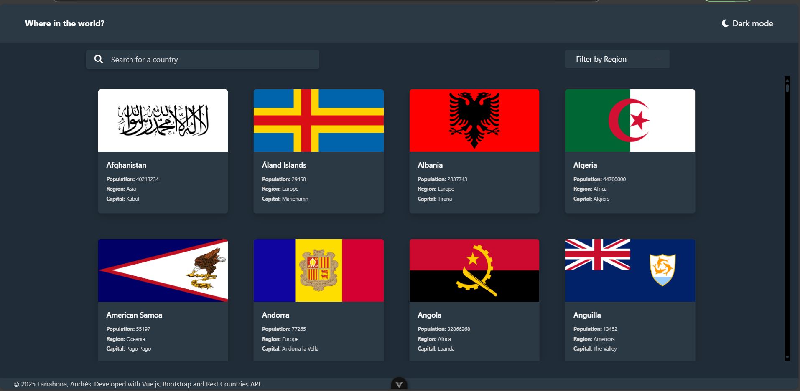
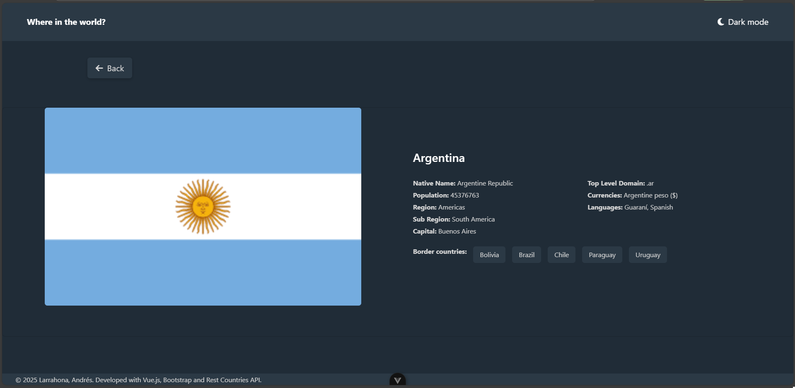

# Vue.js Country Information App

A web application developed in Vue.js that allows users to explore detailed information about all the countries in the world using a public API. This project demonstrates my ability to implement a pre-existing design and create a responsive layout with Vue.js and Bootstrap starting from a desktop-first approach.

# Key Features

- **Country list**: Displays a list of countries with their flags and names.
- **Country details**: Shows detailed information such as capital, population, region, languages, and more when a country is selected.
- **Conditional rendering**: Uses v-if/v-else to toggle between the list of countries and the details of a selected country.
- **Component communication**: Implements props and emits for communication between components.
- **Custom responsive design**: Built with Bootstrap and enhanced with custom CSS classes for additional functionality.

# Key Highlights

- **Design implementation**: The project's design was provided externally, and I translated it into functional code, ensuring a close match to the original design.
- **Custom CSS classes**: While Bootstrap was used as the foundation, I created custom CSS classes to extend its capabilities and achieve the desired design.
- **Desktop-first approach**: The design process started with a desktop layout, which was later adapted to be fully responsive across all devices.

# Technologies Used

**Vue.js 3**: For building the user interface.
**Bootstrap**: For styling and responsive design, enhanced with custom CSS.
**Rest Countries API**: To fetch country data stored in local directory.
**HTML/CSS**: For additional custom styles and responsiveness.

# How It Works
**1. Initial view**: Displays a list of all countries.
**2. Country selection**: When a country is clicked, its details are shown.
**3. Component communication**: The selected country's data is passed as a prop to the details component, which then displays the information.

# Screenshots

Country List

Country Details
Details view of a selected country.

# Why This Project?

This project showcases:

- My ability to **implement a pre-existing design** into functional code.
- Proficiency in **Vue.js** and its ecosystem
- Strong **CSS skills**, combining Bootstrap with custom classes to achieve a unique design.
- A **desktop-first approach** to responsive design, ensuring compatibility across all devices.
